来源刨洞安全

SSTI

根据线索：

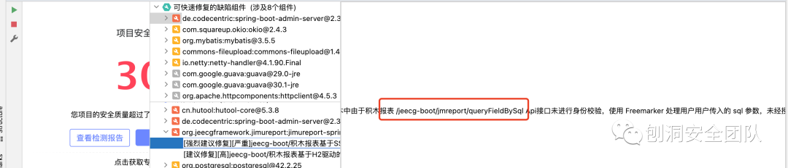

直接用 `JADX` 找到对应代码

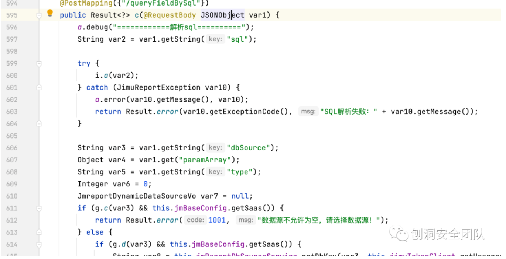

很直接嘛，直接传入 `sql`，那直接构造请求先试试：

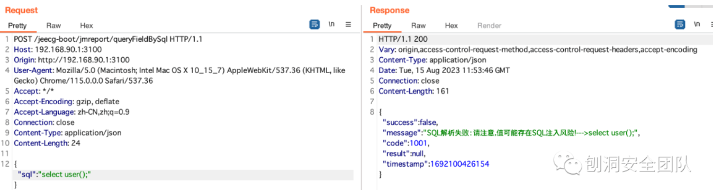

居然还有黑名单

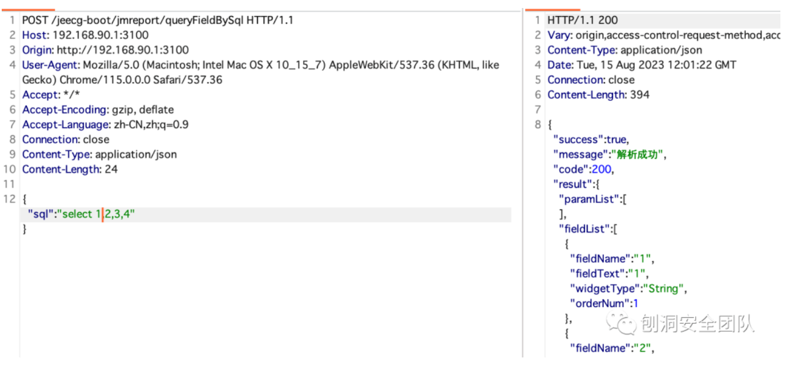

这里起码还有个 `SQL` 注入漏洞

线索中说明了用 `Freemarker` 处理了传入的 `sql` 语句，那直接打 `SSTI` 试试

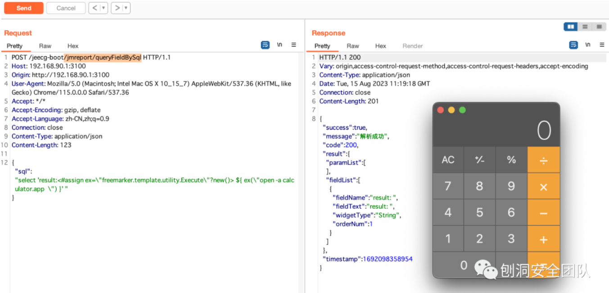

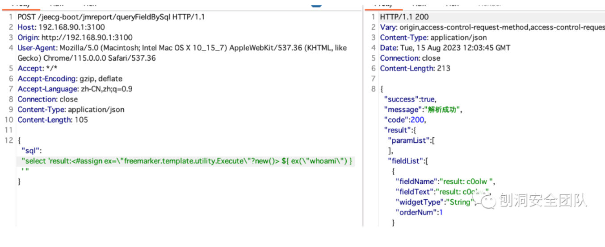

JDBC RCE

漏洞利用有个前提，必须有 `H2` 驱动的依赖

用 `JADX` 在反编译的代码中搜索 `testConnection`，找到对应的接口

```
org.jeecg.modules.jmreport.desreport.a.a#a(org.jeecg.modules.jmreport.dyndb.vo.JmreportDynamicDataSourceVo)
```

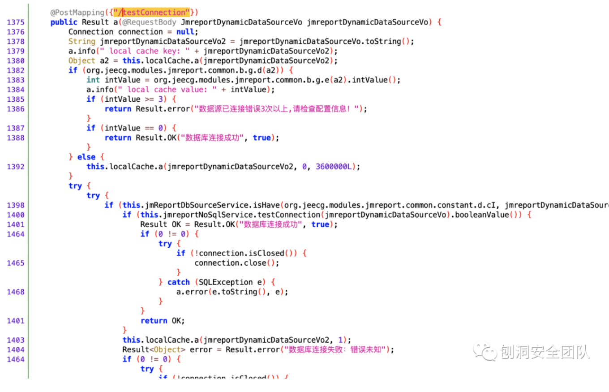

在 `IDEA` 中查看

代码被压的爹妈都不认识了

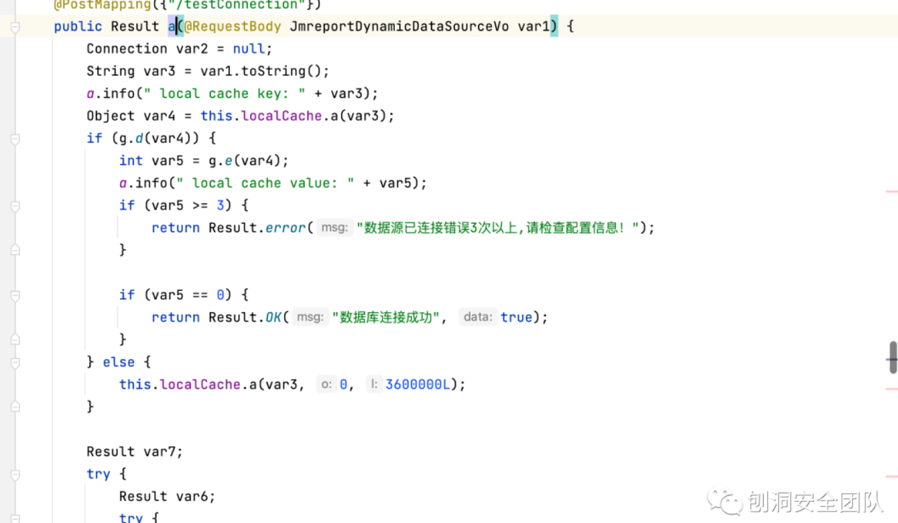

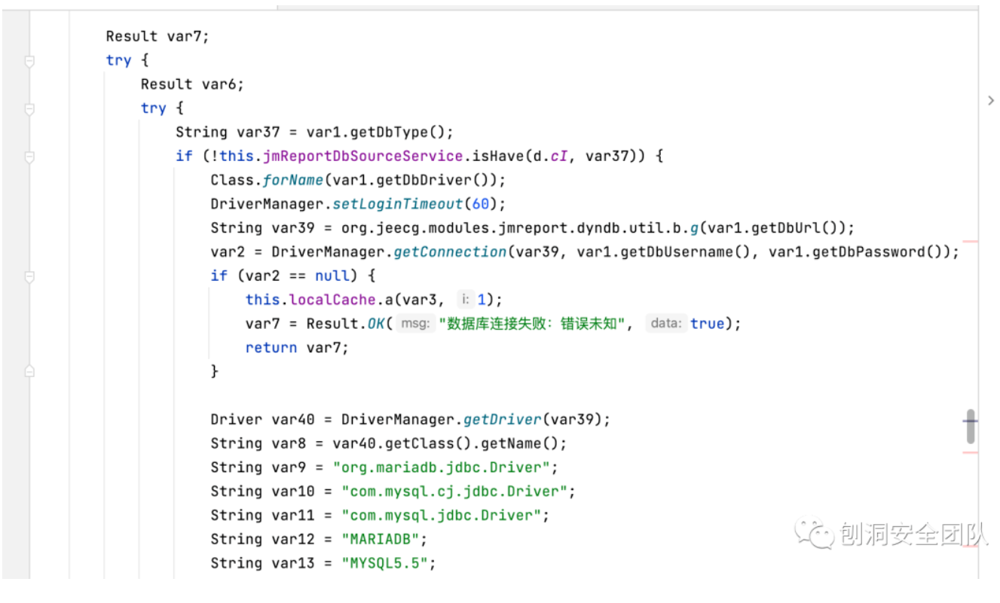

根据入参 `@RequestBody JmreportDynamicDataSourceVo var1` 知道，传入一个 `JmreportDynamicDataSourceVo` 对象的 `JSON`

**JmreportDynamicDataSourceVo**

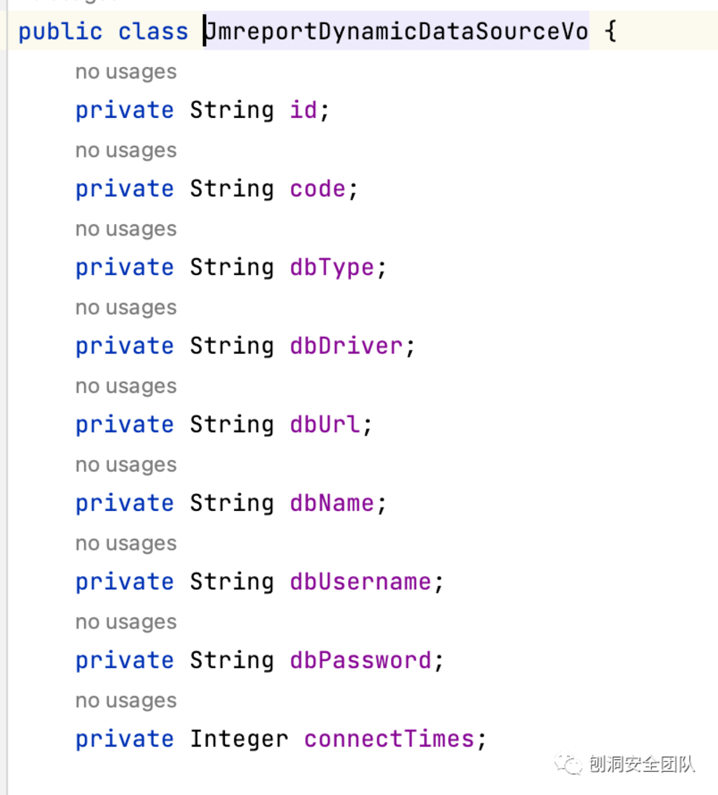

里面能自定义 `dbUrl`，那么就直接构造参数，试试看

`dbUrl` 用前段时间的 `metabase poc` 改改

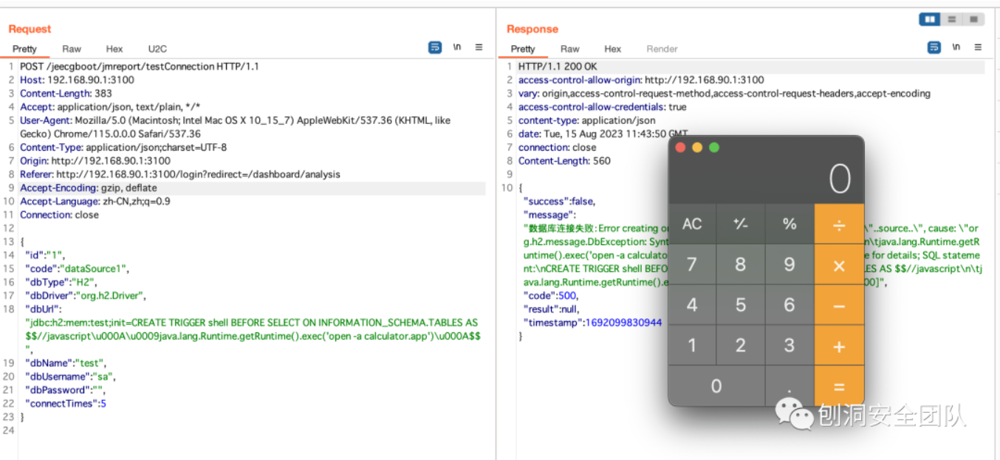
