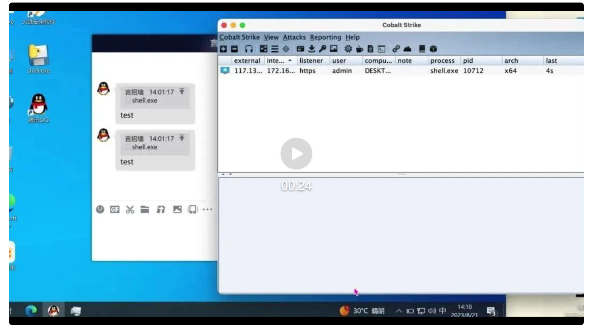

来源： [WIN哥学安全](javascript:void(0);)

漏洞简介

​    2023年8月20日，赛博昆仑捕获到利用QQ桌面客户端远程执行的漏洞，该漏洞为逻辑漏洞，攻击者可以利用该漏洞在QQ客户端上进行无需用户确认文件下载执行为，当用户点击消息链接时，QQ客户端会自动下载并打开文件，最终实现远程代码执行的目的。建议谨慎点击任何消息链接。


影响版本

```
QQ Windows版9.7.13及以前版本
```


漏洞复现

A发送恶意文件给A。


A在手机上回复此恶意文件


A在电脑上将此回复转发给B

B点击直接上线。

